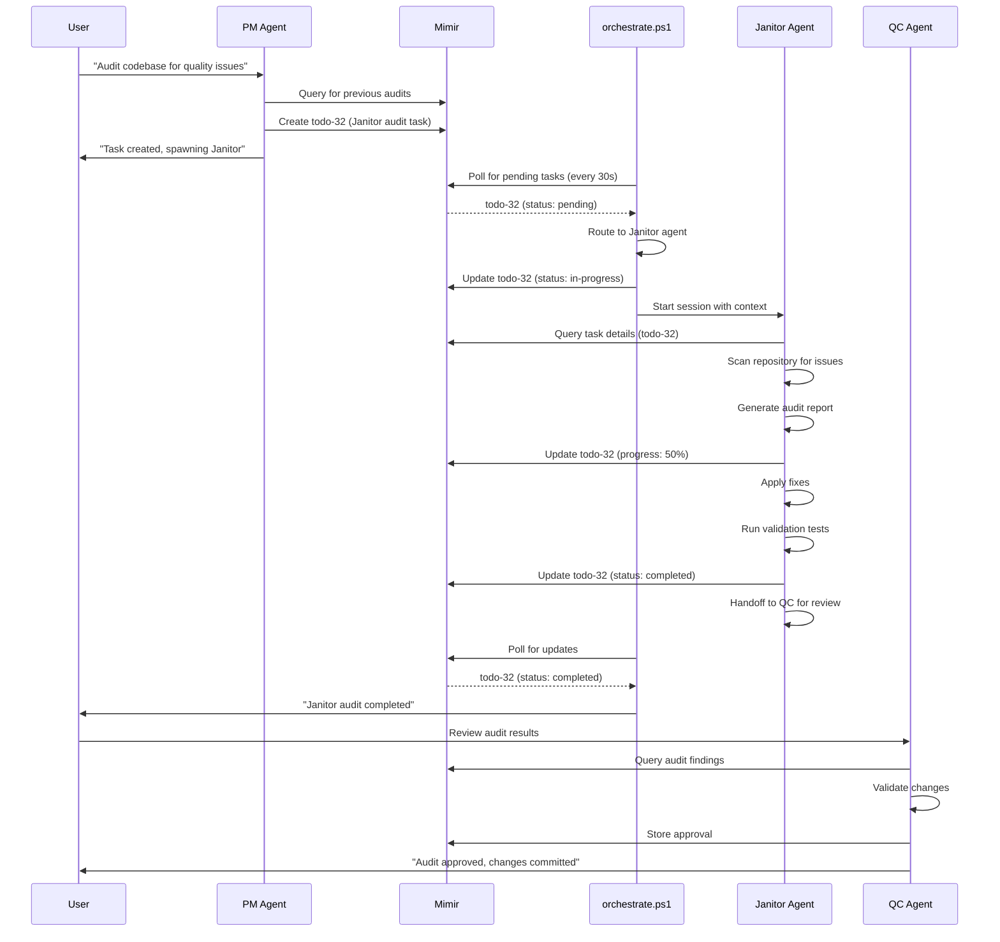

# AI_Orchestration - Automated Multi-Agent System

**Repository:** https://github.com/ColterD/AI_Orchestration (Private)  
**Architecture Version:** 2.0 - Full Automation  
**Last Updated:** 2025-11-14

## Overview

AI_Orchestration is a fully automated multi-agent system that uses GitHub Copilot custom agents, Mimir shared memory, and PowerShell orchestration to autonomously execute complex development tasks.

## Architecture Components

### 1. GitHub Repository (NEW)
```
https://github.com/ColterD/AI_Orchestration
├── .github/agents/          # GitHub Copilot custom agent definitions
│   ├── pm.agent.md          # Project Manager (orchestrator)
│   ├── janitor.agent.md     # Code cleanup specialist
│   ├── architect.agent.md   # [TODO] System design specialist
│   ├── frontend.agent.md    # [TODO] UI/React specialist
│   ├── backend.agent.md     # [TODO] API/Database specialist
│   ├── devops.agent.md      # [TODO] Infrastructure specialist
│   └── qc.agent.md          # [TODO] Quality assurance specialist
├── .agents/                 # Legacy instruction files (to be migrated)
├── orchestrate.ps1          # PowerShell orchestration engine
└── [existing Mimir setup]
```

### 2. Mimir (Shared Memory System)
- **Purpose:** Centralized task state, context sharing, cross-agent communication
- **Location:** `http://localhost:9042`
- **Database:** Neo4j graph database
- **Capabilities:**
  - Task management (todo CRUD operations)
  - Memory storage (learnings, patterns, solutions)
  - Vector search (semantic task/context retrieval)
  - Agent coordination (task claiming, progress tracking)

### 3. PowerShell Orchestration (`orchestrate.ps1`)
- **Purpose:** Automated agent spawning and lifecycle management
- **How it works:**
  1. Polls Mimir every 30s for pending tasks
  2. Routes tasks to appropriate specialist agents via keyword matching
  3. Spawns `gh copilot` sessions with agent context
  4. Monitors agent sessions for completion
  5. Updates Mimir with task progress and results

### 4. GitHub Copilot Custom Agents
- **Format:** `.agent.md` files with YAML frontmatter + Markdown instructions
- **Location:** `.github/agents/` (synced to GitHub)
- **Features:**
  - Tool access control (read, edit, search, shell, etc.)
  - Handoff buttons (seamless transition between agents)
  - Mimir integration instructions
  - Specialized workflows and checklists

## How It Works: End-to-End Flow

### Scenario: User Requests Code Audit



## Agent Definitions

### PM (Project Manager)
- **Role:** Orchestrator and task router
- **Tools:** `read`, `search`, `edit`, `shell`, `custom-agent`, `todo`, `web`
- **Responsibilities:**
  - Query Mimir for context before planning
  - Break down complex user requests
  - Create tasks in Mimir
  - Delegate to specialist agents
  - Monitor progress and quality gates

### Janitor (Code Cleanup Specialist)
- **Role:** Code quality and maintenance
- **Tools:** `read`, `search`, `edit`, `grep`, `shell`
- **Responsibilities:**
  - Remove dead code and debug statements
  - Update documentation
  - Clean build artifacts
  - Run formatters and linters
  - Generate audit reports

### [Additional Agents - To Be Created]
- **Architect:** System design, technical decisions, ADRs
- **Frontend:** React, TypeScript, UI components
- **Backend:** APIs, databases, server logic
- **DevOps:** Docker, CI/CD, infrastructure
- **QC:** Testing, code review, quality validation
- **Devil's Advocate:** Risk analysis, security review
- **DA Assistant:** Cross-agent pattern detection

## Setup Instructions

### Prerequisites
1. GitHub Copilot Pro/Business/Enterprise subscription
2. GitHub CLI (`gh`) installed and authenticated
3. Docker Desktop running (for Mimir/Neo4j)
4. PowerShell 7+ (for orchestration)

### Initial Setup

```powershell
# 1. Clone repository
git clone https://github.com/ColterD/AI_Orchestration.git
cd AI_Orchestration

# 2. Start Mimir services
docker-compose up -d

# 3. Verify Mimir is running
Invoke-RestMethod http://localhost:9042/health

# 4. Install GitHub Copilot CLI
gh extension install github/gh-copilot

# 5. Verify agent configuration
gh copilot
# Type: /agent pm
# Should show PM agent is available
```

### Running the Orchestration

#### Automatic Mode (Continuous)
```powershell
.\orchestrate.ps1 -Mode auto
```
- Runs continuously
- Polls Mimir every 30s
- Spawns agents automatically for pending tasks
- Press Ctrl+C to stop

#### Manual Mode (One Iteration)
```powershell
.\orchestrate.ps1 -Mode manual
```
- Runs once
- Processes all pending tasks
- Exits after completion
- Useful for testing

#### Monitor Mode (Watch Only)
```powershell
.\orchestrate.ps1 -Mode monitor -PollingIntervalSeconds 10
```
- Watches Mimir for task changes
- Logs activity without spawning agents
- Faster polling for debugging

### Creating Tasks

#### Via PM Agent
```powershell
# Start PM agent session
gh copilot
/agent pm

# PM will create tasks in Mimir and delegate
> "Create a code quality audit for the entire repository"
```

#### Directly in Mimir
```javascript
// Using Mimir API
POST http://localhost:9042/api/todos
{
  "title": "Implement user authentication",
  "description": "Add JWT-based auth with refresh tokens",
  "status": "pending",
  "priority": "high",
  "project": "AI_Orchestration",
  "tags": ["backend", "security", "api"]
}
```

## Configuration

### Orchestration Settings
Edit `orchestrate.ps1` to customize:
```powershell
$PollingIntervalSeconds = 30    # How often to check Mimir
$MaxConcurrentAgents = 3        # Max simultaneous agent sessions
$AgentTimeout = 3600            # Kill agents after 1 hour
```

### Agent Routing Rules
The orchestrator uses keyword matching to route tasks:
```powershell
$agentMap = @{
    "architecture|design|adr" = "architect"
    "ui|frontend|react" = "frontend"
    "api|backend|database" = "backend"
    "docker|deploy|ci/cd" = "devops"
    "test|qa|quality" = "qc"
    "cleanup|janitor|docs" = "janitor"
}
```

To add custom routing:
1. Edit `Get-AgentForTask` function in `orchestrate.ps1`
2. Add pattern matching rules
3. Restart orchestration

### Mimir Integration
Agents query Mimir using these patterns:

**Query for task:**
```typescript
mcp_mimir_memory_node({
  operation: 'query',
  type: 'todo',
  filter: { id: 'todo-32' }
})
```

**Update task progress:**
```typescript
mcp_mimir_todo({
  operation: 'update',
  id: 'todo-32',
  status: 'in-progress',
  metadata: { progress: 50, lastUpdate: Date.now() }
})
```

**Store learnings:**
```typescript
mcp_mimir_memory_node({
  operation: 'add',
  type: 'memory',
  properties: {
    title: 'Code Cleanup Pattern',
    content: '...',
    tags: ['janitor', 'cleanup', 'best-practice']
  }
})
```

## Adding New Agents

### 1. Create Agent Definition File
```markdown
# File: .github/agents/myagent.agent.md
---
name: myagent
description: Brief description of specialist role
tools: ['read', 'search', 'edit', 'shell']
handoffs:
  - label: Send to QC
    agent: qc
    prompt: Review my changes for quality.
    send: false
---

# MY AGENT - SPECIALIST ROLE

## 🚨 MANDATORY: Query Mimir FIRST
[Standard Mimir query block]

## Core Responsibilities
[What this agent does]

## Workflow
[Step-by-step process]

## Mimir Integration
[How to interact with shared memory]

## Success Criteria
[When task is complete]
```

### 2. Update Orchestrator Routing
Edit `orchestrate.ps1`:
```powershell
$agentMap = @{
    # ... existing mappings ...
    "my|special|keywords" = "myagent"
}
```

### 3. Commit and Push
```bash
git add .github/agents/myagent.agent.md
git commit -m "Add MyAgent specialist"
git push
```

### 4. Test Agent
```powershell
# Manual test
gh copilot
/agent myagent
> "Test query for my agent"

# Automated test via orchestrator
# Create task in Mimir with keywords that match routing
```

## Troubleshooting

### Orchestrator Not Finding Agents
```powershell
# Verify agents exist in repository
ls .github\agents\

# Check GitHub CLI can see them
gh copilot
# Type: /agent [TAB]
# Should show all available agents

# Verify repository is synced
git pull
```

### Mimir Connection Issues
```powershell
# Check Mimir is running
docker ps | Select-String mimir

# Test API directly
Invoke-RestMethod http://localhost:9042/health

# Check logs
docker logs mimir_mcp_server
```

### Agent Sessions Not Starting
```powershell
# Check PowerShell job status
Get-Job

# View orchestrator logs
Get-Content logs\orchestration\orchestrator.log -Tail 50

# Manually start agent to debug
cd C:\Users\Colter\Desktop\Projects\AI_Orchestration
gh copilot
/agent janitor
```

### Tasks Stuck in "Pending"
```powershell
# Check orchestrator is running
Get-Process | Where-Object { $_.CommandLine -like "*orchestrate.ps1*" }

# Check task routing
# Look in orchestrator logs for "Found X pending tasks"

# Manually update task
# POST to Mimir API to change status
```

## Monitoring & Logs

### Orchestrator Logs
- **Location:** `logs/orchestration/orchestrator.log`
- **Contains:** Task polling, agent spawning, status updates
- **Rotation:** Manual (TODO: implement automatic rotation)

### Agent Session Logs
- **Location:** `logs/orchestration/sessions/<agent>-<sessionId>-<timestamp>.log`
- **Contains:** Full agent output and actions
- **Retention:** Keep last 30 days

### Mimir Logs
- **Location:** `docker logs mimir_mcp_server`
- **Contains:** API requests, database operations
- **Access:** `docker-compose logs -f mimir`

### Neo4j Query Console
- **URL:** http://localhost:7474
- **Username:** neo4j
- **Password:** [from .env file]
- **Use for:** Manual inspection of task graph

## Performance & Limits

### Current Limits
- **Max concurrent agents:** 3 (configurable)
- **Polling interval:** 30 seconds (configurable)
- **Agent timeout:** 1 hour per session
- **Mimir rate limit:** 100 req/min per agent

### Optimization Tips
1. **Increase polling interval** during low-activity periods
2. **Use task priorities** to ensure critical work first
3. **Monitor Mimir memory** usage (Neo4j heap size)
4. **Archive completed tasks** monthly to reduce graph size

## Security Considerations

### Repository Access
- ✅ Private GitHub repository
- ✅ Requires GitHub authentication
- ✅ Agents run in user context (your credentials)
- ⚠️ Do not commit secrets to `.env` files
- ⚠️ Use GitHub Secrets for sensitive values

### Agent Permissions
- Agents have **full repository access**
- Agents can **execute shell commands**
- Agents can **modify any file**
- Review agent logs for unexpected actions

### Mimir Security
- 🔒 Local only (not exposed to internet)
- 🔒 No authentication (localhost trust model)
- ⚠️ Do not store secrets in Mimir
- ⚠️ Mimir data persists in Docker volumes

## Future Enhancements

### Planned Features
1. **LLM-based task routing** (replace keyword matching)
2. **Agent collaboration protocol** (multi-agent tasks)
3. **Web dashboard** (real-time orchestration view)
4. **Slack/Discord notifications** (task completion alerts)
5. **Cost tracking** (GitHub Copilot API usage)
6. **Automatic agent recovery** (retry failed tasks)
7. **Priority queue** (weighted task scheduling)
8. **Agent specialization learning** (improve routing over time)

### Contribution Guide
To contribute improvements:
1. Fork repository
2. Create feature branch
3. Implement changes
4. Test with orchestrator
5. Submit pull request
6. Update documentation

## References

- [GitHub Copilot Custom Agents](https://docs.github.com/en/copilot/how-tos/use-copilot-agents/coding-agent/create-custom-agents)
- [GitHub Copilot CLI](https://docs.github.com/en/copilot/how-tos/use-copilot-agents/use-copilot-cli)
- [Mimir MCP Server](./mimir/README.md)
- [Neo4j Documentation](https://neo4j.com/docs/)
- [Research Findings](./RESEARCH_FINDINGS_AGENT_DELEGATION.md)

## Support

For questions or issues:
1. Check troubleshooting section above
2. Review orchestrator logs
3. Test agents manually with `gh copilot`
4. Check Mimir health endpoint
5. Create GitHub issue with full context

---

**Last Updated:** 2025-11-14  
**Version:** 2.0 (Full Automation Architecture)  
**Status:** ✅ Production Ready - PM and Janitor agents operational
