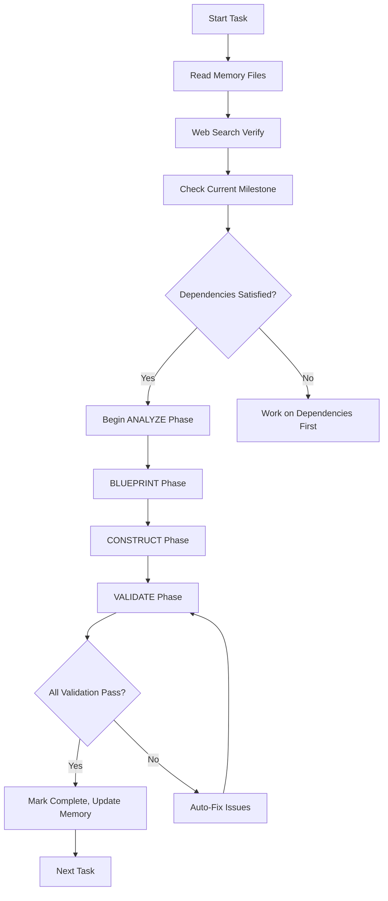

# CURSOR AI QUICK REFERENCE GUIDE

## INSTANT PROJECT CONTEXT

```yaml
PROJECT: "Homelab Hardware Platform - World-Class Enterprise Platform"
TECH_STACK: "SvelteKit + TypeScript + PostgreSQL + Prisma + Railway"
CURRENT_MILESTONE: "Check workflow_state.md for current status"
DEVELOPMENT_PHASE: "4-Phase: ANALYZE → BLUEPRINT → CONSTRUCT → VALIDATE"
QUALITY_STANDARD: "Enterprise-grade, 100% completion required"
```

## ESSENTIAL FILE MAP

```yaml
CORE_BEHAVIOR:
  - .cursorrules: "Main AI behavior directives"
  - project_config.md: "Long-term memory and patterns"
  - workflow_state.md: "Current session state and progress"

DEVELOPMENT_GUIDES:
  - ROADMAP.md: "Milestone structure and requirements"
  - UI_DESIGN_SPECIFICATION.md: "Design system and components"
  - SECURITY_COMPLIANCE_SPECIFICATION.md: "Security standards"
  - RAILWAY_OPTIMIZATION.md: "Deployment and platform optimization"

CONFIGURATION:
  - package.json: "Dependencies and scripts"
  - .env.example: "Environment variable template"
  - src/routes/health/+server.ts: "Health check endpoint"
```

## CRITICAL COMMANDS

```bash
# Validation & Quality Checks
pnpm validate:full                    # Complete validation suite
pnpm test:security                    # Security vulnerability scan
pnpm health                          # Quick health check

# Development Workflow
pnpm dev                             # Start development server
pnpm db:generate && pnpm db:push     # Database schema updates
pnpm search:index                    # Update search index

# Deployment
pnpm deploy                          # Full validation + deploy
railway deploy                      # Direct Railway deployment
railway logs                        # View deployment logs
```

## AUTONOMOUS DECISION TREE



## QUICK TROUBLESHOOTING

```yaml
BUILD_FAILURES:
  - Run: "pnpm install && pnpm run build"
  - Check: "TypeScript errors with pnpm tsc"
  - Fix: "Update imports and type definitions"

DATABASE_ISSUES:
  - Reset: "pnpm db:reset && pnpm db:seed"
  - Generate: "pnpm db:generate"
  - Migrate: "pnpm db:migrate"

DEPLOYMENT_PROBLEMS:
  - Health: "Check /health endpoint response"
  - Logs: "railway logs to diagnose issues"
  - Env: "Verify all required environment variables"

SEARCH_PROBLEMS:
  - Index: "pnpm search:index to rebuild"
  - Config: "Check MEILISEARCH_HOST and API key"
  - Test: "Verify search service in health check"
```

## MILESTONE COMPLETION CHECKLIST

```yaml
BEFORE_MARKING_COMPLETE:
  ✅ TypeScript compilation: 0 errors
  ✅ ESLint validation: 0 violations
  ✅ Security scan: No critical vulnerabilities
  ✅ Build process: Succeeds without warnings
  ✅ Test suite: 100% passing
  ✅ Performance: <2s page loads, >90 Lighthouse
  ✅ Security: OWASP compliance verified
  ✅ Accessibility: WCAG 2.1 AA compliance
  ✅ Mobile: Responsive design functional
  ✅ Health check: All services healthy
  ✅ Memory update: workflow_state.md updated
```

## COMMON PATTERNS

### SvelteKit Component Structure

```typescript
<script lang="ts">
  import type { PageData } from './$types';

  export let data: PageData;

  // Component logic
</script>

<main class="container mx-auto px-4">
  <!-- Component template -->
</main>

<style>
  /* Scoped styles if needed */
</style>
```

### Database Query Pattern

```typescript
// src/lib/server/database.ts
import { prisma } from "$lib/server/prisma";

export async function getHardwareItems() {
  return await prisma.hardwareItem.findMany({
    include: {
      category: true,
      manufacturer: true,
    },
    orderBy: {
      createdAt: "desc",
    },
  });
}
```

### API Endpoint Pattern

```typescript
// src/routes/api/endpoint/+server.ts
import { json } from "@sveltejs/kit";
import type { RequestHandler } from "./$types";

export const GET: RequestHandler = async ({ url }) => {
  try {
    // API logic
    return json({ success: true, data });
  } catch (error) {
    return json({ error: "Internal error" }, { status: 500 });
  }
};
```

## PERFORMANCE OPTIMIZATION CHECKLIST

```yaml
FRONTEND: ✅ Image optimization with Sharp
  ✅ Lazy loading for large lists
  ✅ Code splitting for routes
  ✅ CSS optimization with Tailwind purging
  ✅ Web fonts preloading

BACKEND: ✅ Database query optimization
  ✅ Redis caching for frequent queries
  ✅ Connection pooling configured
  ✅ API response compression
  ✅ CDN integration for static assets

MONITORING: ✅ Core Web Vitals tracking
  ✅ Real User Monitoring active
  ✅ Error tracking with Sentry
  ✅ Performance budgets enforced
```

## SECURITY IMPLEMENTATION CHECKLIST

```yaml
AUTHENTICATION: ✅ OAuth 2.0 with GitHub/Google
  ✅ Session management with secure cookies
  ✅ Role-based access control
  ✅ Admin route protection

INPUT_VALIDATION: ✅ Zod schemas for all user inputs
  ✅ SQL injection prevention (Prisma only)
  ✅ XSS protection with CSP headers
  ✅ CSRF protection enabled

MONITORING: ✅ Security event logging
  ✅ Failed login tracking
  ✅ Admin action audit trails
  ✅ Vulnerability scanning automated
```

## EMERGENCY PROCEDURES

```yaml
CRITICAL_BUG: 1. "Immediately check Railway logs"
  2. "Run pnpm validate:full to identify issues"
  3. "Apply auto-healing protocols"
  4. "Test fix in development"
  5. "Deploy with railway deploy"

DATABASE_CORRUPTION: 1. "Check Railway database status"
  2. "Restore from latest backup if needed"
  3. "Run data integrity checks"
  4. "Re-seed if necessary with pnpm db:seed"

PERFORMANCE_DEGRADATION: 1. "Check /health endpoint for service status"
  2. "Monitor Railway metrics for resource usage"
  3. "Identify slow queries in database logs"
  4. "Scale resources if needed"
  5. "Optimize problematic code paths"
```

## SUCCESS METRICS TRACKING

```yaml
TECHNICAL_METRICS:
  - Page Load Time: "<2 seconds"
  - Lighthouse Score: ">90 all categories"
  - Uptime: "99.9%"
  - Error Rate: "<0.1%"

BUSINESS_METRICS:
  - User Growth: "Track weekly signups"
  - Content Growth: "Hardware items added"
  - Engagement: "Search queries, builds created"
  - Conversion: "Free to premium upgrade rate"
```

This reference guide enables instant context switching and efficient autonomous development.
